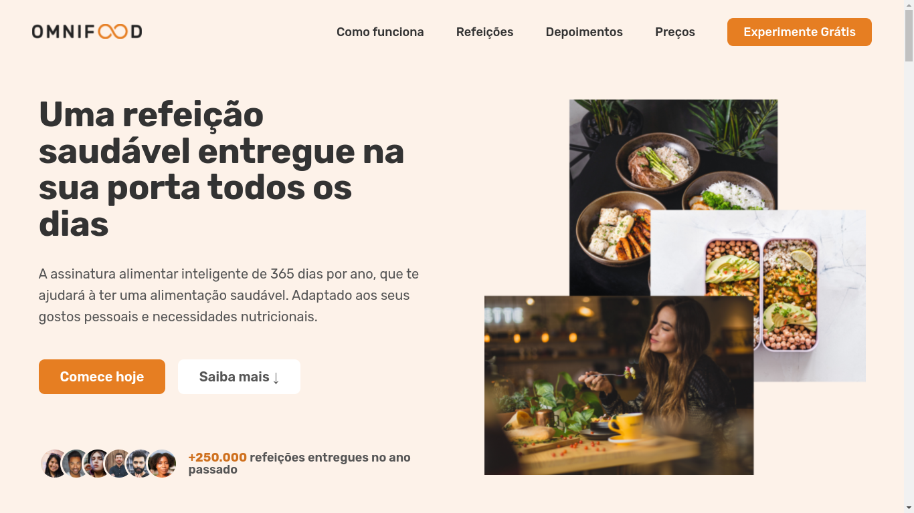
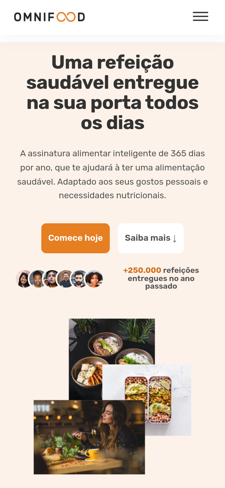

<h1 align="center">
  
</h1>

  <a href="#-tecnologias">Tecnologias</a>&nbsp;&nbsp;&nbsp;|&nbsp;&nbsp;&nbsp;
  <a href="#-projeto">Projeto</a>&nbsp;&nbsp;&nbsp;|&nbsp;&nbsp;&nbsp;
  <a href="#-solução">Solução</a>&nbsp;&nbsp;&nbsp;|&nbsp;&nbsp;&nbsp;
  <a href="#-como-executar">Como executar</a>&nbsp;&nbsp;&nbsp;|&nbsp;&nbsp;&nbsp;
  <a href="#-licença">Licença</a>

  

 

 

 
 

## ✨ Tecnologias

Esse projeto foi desenvolvido com as seguintes tecnologias:

- [HTML](https://developer.mozilla.org/pt-BR/docs/Web/HTML)
- [CSS](https://www.w3schools.com/css/)
- [JavaScript](https://www.javascript.com/)

## 💻 Projeto

Omnifood tem um grande foco no bem-estar do consumidor por meio de uma alimentação saudável. A maioria das pessoas estão muito ocupadas com seus trabalhos, família, amigos, dentre outras atividades importantes, e não sobra muito tempo para cozinhar. Isso pode levar a uma dieta muito pobre e consequências duradouras para a saúde. Portanto, queremos resolver esse problema com uma abordagem centrada em IA. Os usuários poderão usar nosso aplicativo para selecionar a sua dieta e os alimentos que gostam e não gostam, e nosso algoritmo de IA criará um plano de refeições semanal, personalizado e individual.

## 💡 Solução

Nessa aplicação foram explorados alguns conceitos importantes:

- [x] HTML, CSS e Javascript puro
- [x] Responsividade e acessibilidade

## 🚀 Como executar

- Clone o repositório
- Abra o arquivo index.html em seu navegador favorito

## 📄 Licença

Esse projeto está sob a licença MIT.

---

  
Feito com :coffee: e &#129304; por <strong>Marcos Wlrich</strong>

